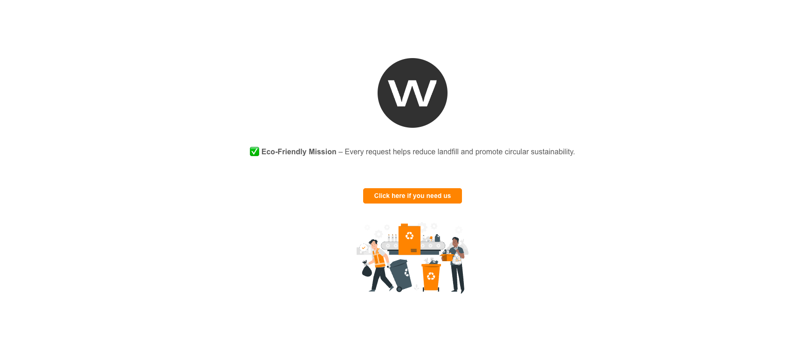

# Waste Collection Service Form

 

A NextJS page for waste collection services with multiple sections, validation, and API integration. Coding Challenge.

My approach was to make the whole page simpler once I read carefully that only one page was needed, I've focused on highlighting the requested. Instead of using vertical cards, I used horizontal cards providing other necessary information and displayed a radio button when a skip is selected.

## Features

- 📝 Multi-section form with accordion navigation
- 🏠 Address validation and autocomplete
- ♻️ Waste type selection with conditional fields
- 📅 Date picker for delivery/collection scheduling
- 💳 Skip selection with real-time pricing
- 📸 Photo upload for permit requirements
- ✅ Comprehensive form validation
- 📱 Fully responsive design

 

## Form Sections

1. **Delivery Information**
   - Full address details
   - Postcode validation

2. **Waste Details**
   - Waste type checkboxes (Construction, Household, etc.)
   - Overweight materials selection
   - Plasterboard percentage (if applicable)

3. **Skip Selection**
   - Real-time skip options by location
   - Pricing breakdown
   - Hire period selection

4. **Permit & Placement**
   - Permit type selection (Public/Private)
   - Skip placement photo upload

5. **Schedule Dates**
   - Delivery date picker
   - Collection date picker

6. **Client Information**
   - Contact details
   - Email/phone validation

## Technologies Used

- ⚛️ React 18
- 🎨 Tailwind CSS
- 📋 React Hook Form
- 📅 React Datepicker
- 🌐 Fetch API
- 🏷️ TypeScript

## Installation

1. Clone the repository:
   ```bash
   git clone https://github.com/drnsanda/wewantwaste-frontend
   cd wewantwaste-frontend